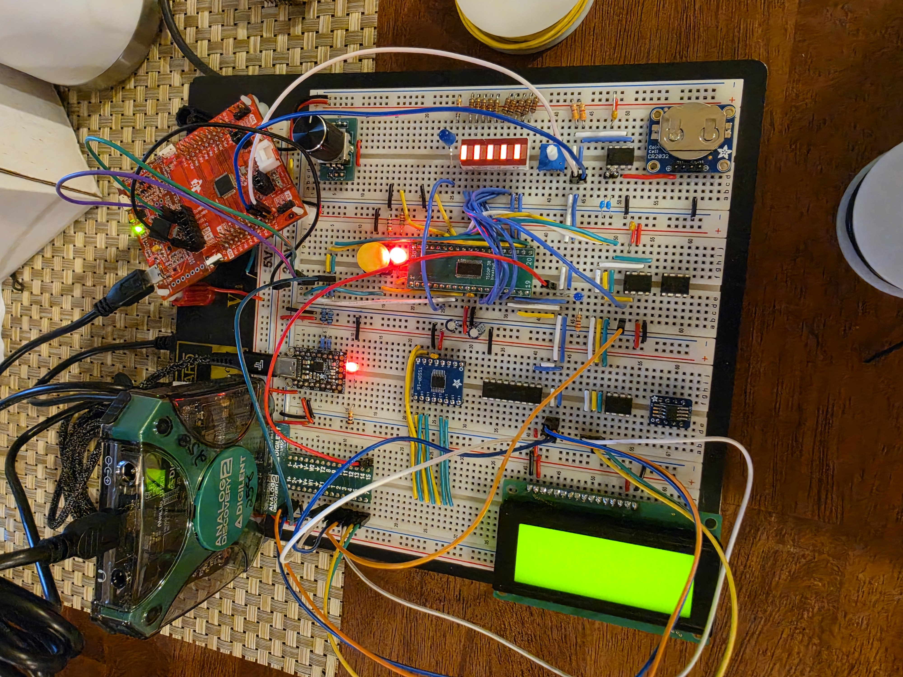

# Gort OS - an Embedded Operating System
#### Author: [Ryan Dupuis](https://github.com/rdupu13)

## Platforms:
* **TI MSP430FR2153 microcontroller unit**

---
```
MSP430FR2153 needs an operating system, and gort is up to the task!

no one could ever fathom that gort would ever have an os

behold, GORTOS!
```
---

## [Features](docs/gortos.md)
Gort OS is fully functional with driver support for the following peripherals:

* 4 timer modules (TIMER)
* universal asynchronous receiver-transmitter (UART)
* inter-integrated circuit (I2C)
* serial peripheral protocol (SPI)
* analog-to-digital converter (ADC)
* 26 reconfigurable general-purpose I/O pins (SWITCH, LED)
* general-purpose pattern generator (PATTERNS)
* pulse-width modulation (PWM, coming soon)

Gort OS supports a variety of breadboard modules, suitable for nearly any embedded project:

* CP2102N USB-to-UART
* MCP7940N real-time clock module (RTC)
* 23LC1024 128KB serial mini memory manager (MMM)
* more soon...


## Development

Follow instructions [[here](https://github.com/rdupu13/msp430-dev/blob/main/msp430_dev_setup.md)] for how to setup your own MSP430 development environment on Linux or WSL. No Code Composer Studio required!

## EELE 465

This project was created in part to fulfill the requirements of the MSU course [EELE 465 - Microcontroller Applications](https://catalog.montana.edu/coursedescriptions/eele/). Below are reports detailing the development and testing of several components of the Gort System:

* Lab 0: [Heartbeat LED](mcu/test/main.c)
* Lab 1: GitHub and Markdown
* Lab 2: [I2C Bit-Banging](docs/labs/lab2_i2c_bb.md) (8/24/2026)
* Lab 3: [RTC and LED Patterns](docs/labs/lab3_rtc_patterns.md) (~7/26/2026)
* Lab 4: ADC and SPI
* Lab 5: LCD and DAC
* Lab 6: Dial and Menu
* Lab 7: Thermoelectric Cooler System
* Final Project: Gort OS

[Course BOM](docs/eele465_bom.md)

## Breadboard


## Circuit Diagram


## Software Architecture


---
P.S. gorb is my bb <3