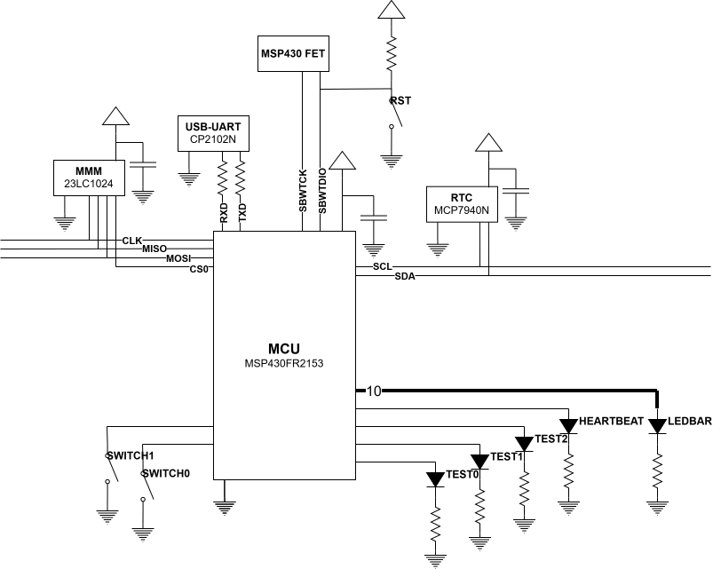
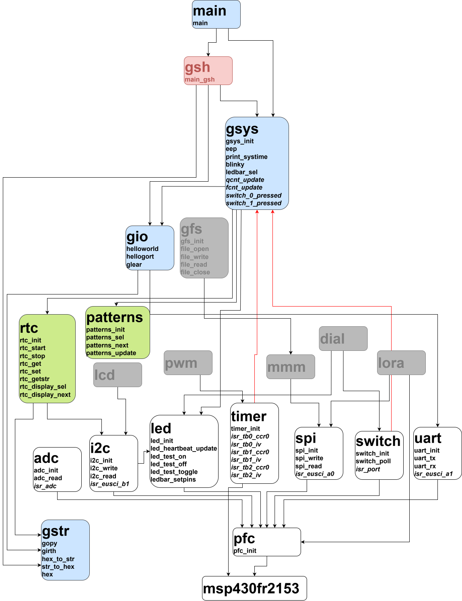

# GORTOS

an embedded operating system

## platforms:
TI MSP430FR2153 microcontroller unit

#### author: ryan dup

MSP430FR2153 needs an operating system, and gort is up to the task!

no one could ever fathom that gort would ever have an os

and then she did

behold, GORTOS!

gort os is fully functional with driver support for the following peripherals:

* ON-CHIP
    - 4 timer modules (TIMER)
    - universal asynchronous receiver-transmitter (UART)
    - inter-integrated circuit (I2C)
    - serial peripheral protocol (SPI)
    - analog-to-digital converter (ADC)
    - 26 reconfigurable general-purpose I/O pins (SWITCH, LED)
    - general-purpose pattern generator (PATTERNS)
    - pulse-width modulation (PWM, coming soon)

gort os supports a variety of off-chip modules, suitable for any embedded project:

* ON-
    - real-time clock module (RTC)
    - 128KB serial mini memory manager (MMM)
    - 

---------------------------------------

## circuit diagram

## software architecture

---------------------------------------

P.S. gorb is my bb <3