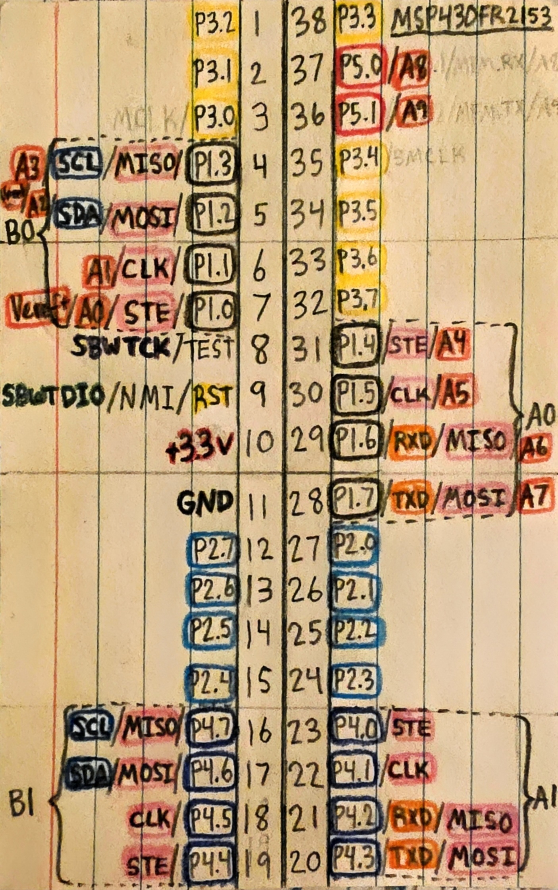
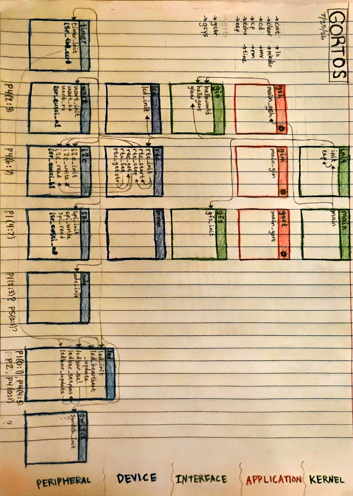

# HARDWARE

## MSP430FR2153
- power
    - VCC (+3.3v)
    - GND
- programming
    - RST / SBWTDIO
    - SBWTCK
- gpio
    - P1.0 - LED_HEARTBEAT
    - P1.1 - LED_TEST0
    - P1.2 - ADC_CH0
    - P1.3 - 
    - P2.0 - LEDBAR_BIT0
    - P2.1 - LEDBAR_BIT1
    - P2.2 - LEDBAR_BIT2
    - P2.3 - LEDBAR_BIT3
    - P2.4 - LEDBAR_BIT4
    - P2.5 - LEDBAR_BIT5
    - P2.6 - LEDBAR_BIT6
    - P2.7 - LEDBAR_BIT7
    - P3.0 - 
    - P3.1 - 
    - P3.2 - 
    - P3.3 - 
    - P3.4 - 
    - P3.5 - 
    - P3.6 - SWITCH1
    - P3.7 - SWITCH0
    - P4.0 - LEDBAR_BIT8
    - P4.1 - LEDBAR_BIT9
    - P4.4 - LED_TEST2
    - P4.5 - LED_TEST1
    - P5.0 - 
    - P5.1 - 
- uart
    - P4.2 - RXD
    - P4.3 - TXD
- i2c
    - P4.6 - SDA
    - P4.7 - SCL
- spi
    - P1.4 - MISO
    - P1.5 - MOSI
    - P1.6 - CLK
    - P1.7 - CS0
---

## embedded system
- led bar 10
- led mux bar 12 (coming soon)
- led spi bar ? (coming soon)
- real-time clock
    - 3.3 v battery
- 1 Mbit ram (coming soon)
- lcd display (coming soon)
- dial pad (coming soon)
---

# SOFTWARE

## drivers
- `adc`
- `i2c`
- `led`
- `spi`
- `switch`
- `timer`
- `uart`
---

## devices
- `dial` (coming soon)
- `lcd` (coming soon)
- `lora` (coming soon)
- `mmm` (coming soon)
- `patterns`
- `pwm` (coming soon)
- `rtc`
---

## kernel
- `gfs` (coming soon)
- `gio`
- `gstr`
- `gsys`
---

## system variables
- `gtime_t gsystime`
- `gtime_t guptime`
- `unsigned char guid`
- `unsigned char gusername[16]`
- `gfile_t *gwd`
- `gfile_t *gin` --> `/dev/tty`
- `gfile_t *gout` --> `/dev/tty`
- `unsigned char display_mode`
---

## time format
### `gtime_t`
- `unsigned char second`
- `unsigned char minute`
- `unsigned char hour`
- `unsigned char weekday`
- `unsigned char date`
- `unsigned char month`
- `unsigned int year`
- string: `"10-13-2003 03:42:00"`
---

## file format
### `gfile_t`
- `unsigned char mode`
    - device? (if type = device) (7:5)
        - 000 - uart?
        - 001 - lcd?
        - 010 - dial?
        - 011 - lora?
        - 100 - ?
        - 101 - ?
        - 110 - ?
        - 111 - ?
    - permissions (4:2)
        - r - read
	    - w - write
        - x - execute
    - type (1:0)
        - 00 - normal
	    - 01 - directory
	    - 10 - device
	    - 11 - ?
- `unsigned int size`
- `unsigned char loaded`
- `char name[16]`
- `char *data`
	- normal: `unsigned char[size]`
	- directory: `*gfile_t[size]`
	- stream: null pointer?
---

## filesystem
### `/`
- `/bin/`
	- `/bin/cat`
    - `/bin/clear`
    - `/bin/cd`
    - `/bin/cp`
    - `/bin/echo`
    - `/bin/eep`
    - `/bin/gim`
    - `/bin/gort`
    - `/bin/gsh`
    - `/bin/ls`
    - `/bin/mkdir`
    - `/bin/mv`
    - `/bin/rm`
    - `/bin/time`
- `/dev/`
    - `/dev/dial`
    - `/dev/lcd`
    - `/dev/lora`
	- `/dev/uart`
- `/home/`
	- `/home/gort/`
- `/sys/`
	- `/sys/log.txt`
- `/tmp/`

### filesystem v2:
- `/boot/`
	- `/boot/gorb`
	- `/boot/gorb.cfg`
- `/proc/`
    - `/proc/0`
    - `/proc/...`
---

# APPLICATIONS
## advanced apps
- `gsh` - gort shell

```c
	const char prompt = '$';
	char cmd_buf = [];
	char c;
	while c != 'EOF':
		print prompt to $stdout
		while c != '\n':
			read char into cmd_buf from $stdin
			print char to $stdout
		locate file path of $arg0:
			check $path
			check $dir
			print "command not found"
```

- `gim` - gort text editor
	open $1

- `gort` - gort?

### advanced apps v2:
- `gorb` - gort bootloader?
- `gmake` - gort make?
- `gdb` - gort debugger?
- `gar` - gort archiver?
- `gapt` - gort advanced package tool?
---

## utilities
- `cat` - Print the contents of a file path $1 to stdout
- `clear` - Clear stdout
- `cd` - Change DIR to path $1
- `cp` - Copy a file path $1 to another specified path $2
- `echo` - Print $1 to stdout
- `eep` - Set a timer for $1 seconds and wait
- `ls` - List the contents of a directory path $1 to stdout
- `mkdir` - Make a directory with path $1
- `mv` - Copy and delete a file path $1 to another specified path $2
- `rm` - Delete a file or directory path $1
- `time` - Print the system time to stdout or configure

### utilities v2:
- `bc` - Print the size of a file path $1 to stdout
- `chmod` - Change the mode bits of a file path $1
- `curl` - 
- `diff` - Compare the contents of two file paths $1 and $2 byte by byte
- `du` - Print disk usage to stout
- `env` - Print the current environment variables to stdout
- `find` - 
- `fsck` - 
- `fdisk` - 
- `grep` - 
- `head` - Print only the first N bytes of a file path $1
- `id` - 
- `kill` - 
- `ln` - 
- `lsmod` - 
- `man` - 
- `mkfs` - 
- `mount` - 
- `netcat` - 
- `ping` - 
- `ps` - 
- `pwd` - Print the current DIR to stdout
- `reboot` - Reboot system
- `rmmod` - 
- `shutdown` - Shutdown system
- `sort` - 
- `ss` - 
- `ssh` - 
- `sudo` - 
- `sysctl` - Configure system variables
- `syslog` - Print system log to stdout
- `tail` - Print only the last N bytes of a file path $1
- `touch` - 
- `tr` - 
- `umount` - 
- `who` - 
- `xxd` - 
---

## Early Development
#### July 2026


