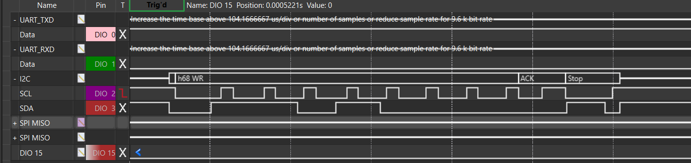
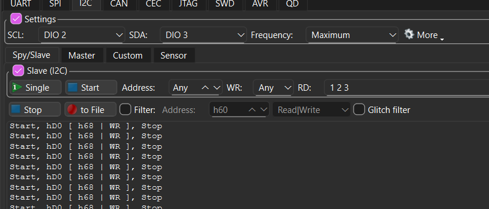
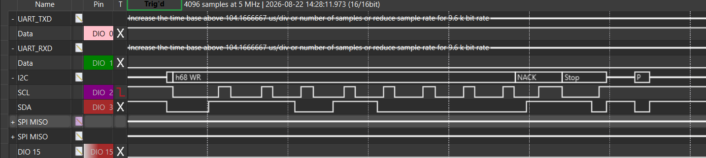
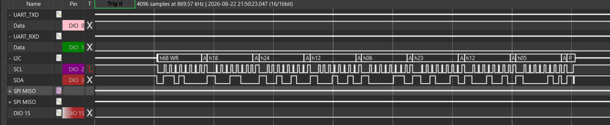
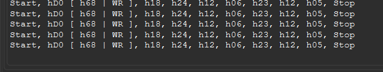
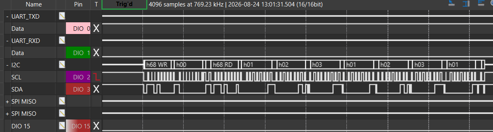
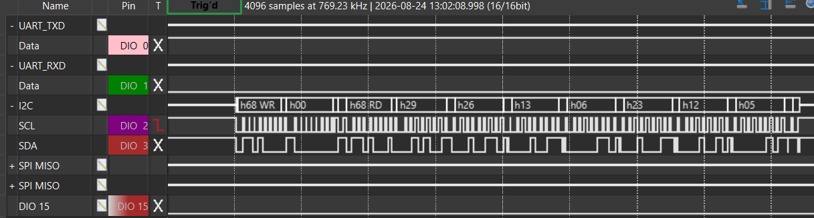

# Lab 2: I2C Bit-Banging

#### Ryan Dupuis
#### EELE 465 | 8/24/2026

## Introduction

In this lab, I "bit-banged" the Inter-integrated Circuit (I2C) serial protocol. That is, I used two of the MCU's GPIO pins to facilitate byte transfers instead of using the dedicated eUSCI serial peripheral on the **MSP430FR2355** MCU. Every set/clear must be done manually, but subroutines were created to streamline this process.

The bit-banger was tested through an Analog Discovery 2 (AD2) that monitored the protocol, along with 2 different Real-Time Clocks (RTCs). The clocks were seen telling the time and retaining register values.

The source file is located here: [mcu/asm/main.s](../../mcu/asm/main.s)


## Start/Stop Conditions and Byte Transmission

I initialized the GPIO pins **P3.1 (SCL)** and **P3.5 (SDA)**, which are separated from any serial peripheral. I then configured them to send an I2C start condition. After verifying that, I created an `i2c_tx_byte` subroutine that drives SCL and SDA. Finally, I made the MCU read from SDA to interpret a NACK/ACK and trigger a stop condition.

Transmitting a byte bit-by-bit involves left-shifting the byte to be sent and deciding based on the carry flag whether to drive SDA high or low. This occurs at the top of every SCL pulse and repeated 8 times for 1 byte. Then, SDA must be reconfigured to be an input and an ACK (low) or NACK (high) is read from the slave on a 9th SCL pulse.




During a NACK, when the AD2 or RTC aren't responding, the bit-banger will automatically trigger a stop condition immediately after.



Either way, an I2C stop condition was set to be triggered at the end of every transaction so as to not jam the bus during development.


## Generic Write Subroutine

I was able to send a start condition, slave address, R/W bit, and multiple subsequent bytes with a generic `i2c_write` subroutine. The caller must specify the length in bytes (`i2c_len`) of the transmission and a register address (`i2c_reg_addr`). The slave address (`i2c_slave_addr`) and data to be sent (`i2c_tx_buf`) where hard-coded for this lab, but could easily be made integer and pointer function arguments.



The AD2, configured as a slave (at address 0x68) in protocol mode, interpreted the transmission correctly:



Though the screenshots don't show a register selection being sent, I later added functionality for it to preceed the contents of `i2c_tx_buf`.


## Generic Read Subroutine

The `i2c_read` subroutine is very similar to `i2c_write`. The `i2c_tx_byte` subroutine was copied and modified to create the `i2c_rx_byte` subroutine, used here. It essentially does what its counterpart does in reverse: read a byte bit-by-bit, left-shift it into memory, then drive SDA high (NACK) or low (ACK). Reading from a register in I2C also involves a repeated start condition and slave address.




## Read RTC date and time

I successfully read the full date and time from a DS32318N RTC. During continuous reading, the seconds register would increment over time, verifying that the bit-banger works with real ICs.




## Set/Save RTC date and time

Below, I show how I successfully used `mspdebug` to set a breakpoint and view the value of `i2c_rx_buf` after reading the first 7 registers of the MCP7940N RTC.

The following proves not only that the time on this particular RTC can be *read*, but also that it is *saved* to memory. The output would've looked extremely similar to the previous screenshot (if I took one), except for a slave address of 0x6F.

### Command-line usage of `mspdebug` to read `i2c_rx_buf`:

I had to consult the symbol table to get the addresses of both the `delay` label (0x8264, 33380 in decimal) and the start of `i2c_rx_buf` (0x2010, 8208 in decimal).

```
(mspdebug) setbreak 33380
Set breakpoint 0
(mspdebug) break
3 breakpoints available:
    0. 0x8264
(mspdebug) run
Running. Press Ctrl+C to interrupt...
Breakpoint 0 triggered (0x8264)
    ( PC: 08264)  ( R4: 0ffff)  ( R8: 08008)  (R12: 00000)  
    ( SP: 02ffe)  ( R5: 000df)  ( R9: 00000)  (R13: 08008)  
    ( SR: 00003)  ( R6: 00000)  (R10: 00000)  (R14: 02008)  
    ( R3: 00000)  ( R7: 02017)  (R11: 01e60)  (R15: 08008)  
0x8264:
    08264: 03 43                     NOP     
    08266: 03 43                     NOP     
    08268: 03 43                     NOP     
    0826a: 14 83                     DEC     R4
    0826c: fb 23                     JNZ     0x8264
    0826e: d2 e3 02 02               XOR.B   #0x01,  &0x0202
    08272: f0 3f                     JMP     0x8254
(mspdebug) hexout 8208 7
hexout: need offset, length and filename
(mspdebug) help hexout
COMMAND: hexout

hexout <address> <length> <filename.hex>
    Save a region of memory into a HEX file.

(mspdebug) hexout 8208 7 rx_buf.hex
Reading    7 bytes from 0x2010...
```

### Contents of `rx_buf.hex`:

```
:0720100080181422240826A9
:00000001FF
```

The `80181422240826` shows the byte sequence corresponding to the 7-byte read from the RTC, which matches what was written during initialization:

August 24th, 2026 @ 14:18:00

## Conclusion

The I2C bit-banger was verified to work with generic read and write subroutines (currently, better than the peripheral itself!! :unamused: I will legitimately consider using it in Gort OS instead of that buggy peripheral interface :bug:).

The MCP7940N RTC also was verified to work for the first time ever and has taken the place of the DS32318N on my breadboard. Updates will need to be made to `rtc.c`, `rtc.h`, and `pfc.h` in the existing gort system.