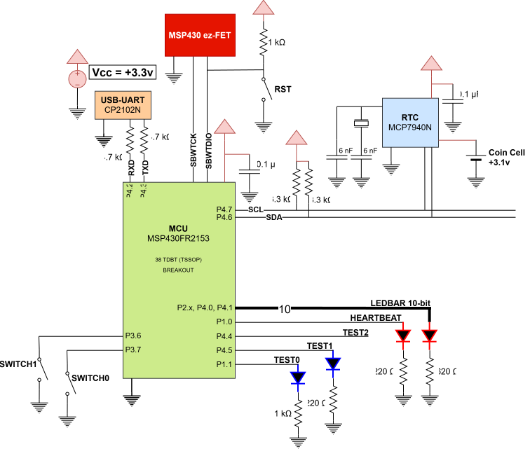

# Lab 3: RTC and LED Patterns

#### Ryan Dupuis
#### EELE 465 | ~7/26/2026

## Introduction

The source files are located here: [mcu/src/](../../mcu/src/)

> [!NOTE]
> This documentation page was created about 3-4 weeks after the code was completed and verified.

## Circuit Diagram
### Requirements met: 1-4, 13, 14

## [UART Driver](../../mcu/src/drivers/uart.c)
### Requirements met: 11, 12

The UART pins are connected to a **CP2102N Adafruit USB-to-UART "Friend"**, which converts the signal into USB and facilitates communication between Gort OS and an external serial monitor.

## [I2C Driver](../../mcu/src/drivers/i2c.c)

### Issues

There's a strong possibility that I switch to using the bit-banged I2C driver from [Lab 2](lab2_i2c_bb.md), implemented in C.

## [RTC Driver](../../mcu/src/devices/rtc.c)
### Requirements met: 5-10, 14, 23-28

### [Integer and String Conversion](../../mcu/src/kernel/gstr.c)

## [Patterns Driver](../../mcu/src/devices/patterns.c)
### Requirements met: 14, 17-22

## [Gort System](../../mcu/src/kernel/gsys.c)
### Requirements met: 2, 3, 13

## [Gort Shell](../../mcu/src/apps/gsh.c)
### Requirements met: 11, 12

### [String Manipulation](../../mcu/src/kernel/gstr.c)

## Conclusion
### Unmet requirements: 15, 16

