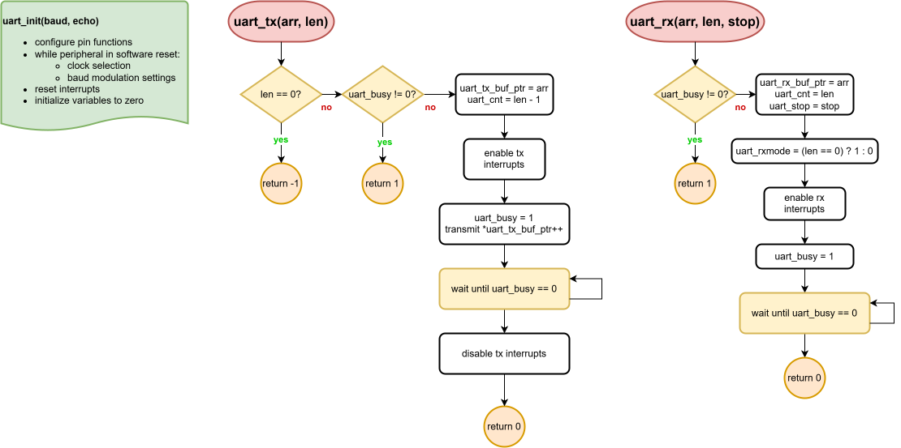
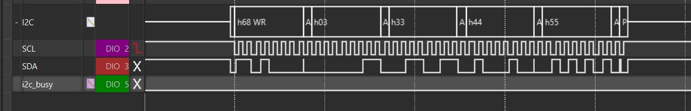
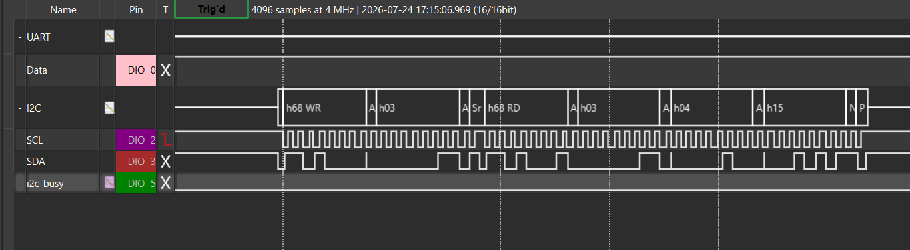
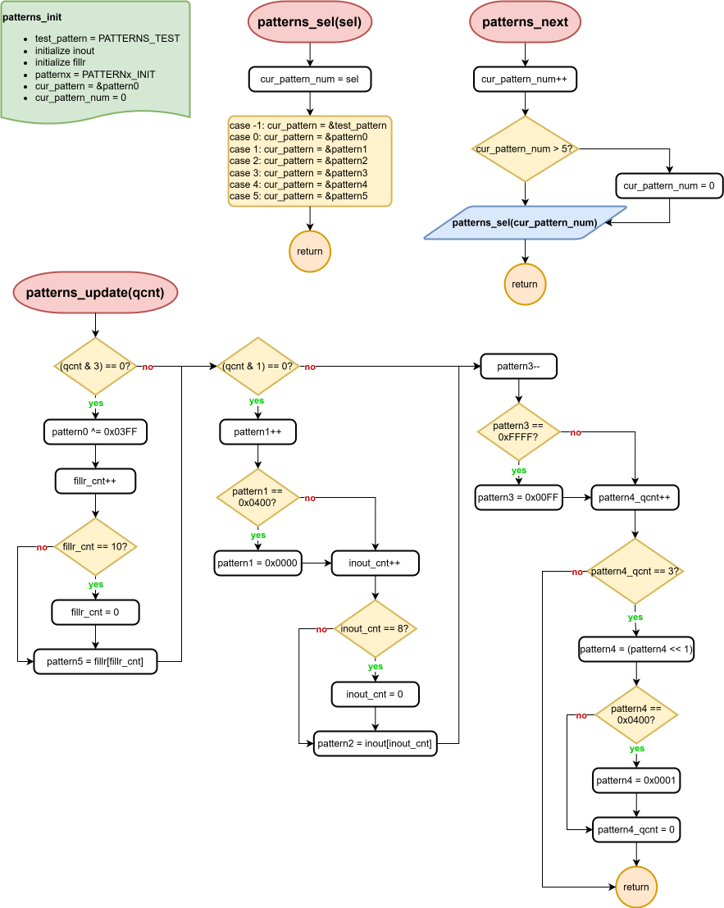
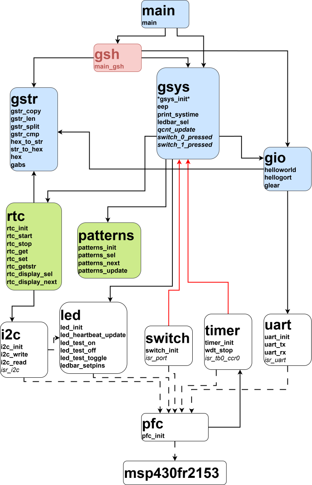
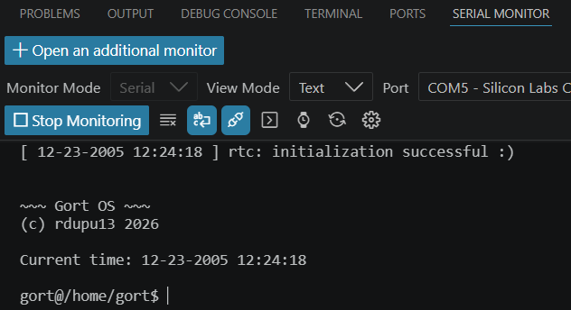

# Lab 3: RTC and LED Patterns

#### Ryan Dupuis
#### EELE 465 | ~7/26/2026

## Introduction

In this lab, we harken back to the days of EELE 467. Fortunately, instead of several labs having blinking LEDs as the core component, only one will. A natural first step for Gort OS is to make it blink some lights (because they're cool to look at :smiley:) and interface with a Real-Time Clock (RTC) over I2C (where we left off in EELE 371). Drivers for UART, I2C, RTC, and Patterns Generation were needed to achieve a simple user interface with 2 buttons and 12 LEDs. 

This time, modularity and consistency in code has brought mostly promising results. An issue arose where the I2C peripheral would jam the bus, so an `i2c-fix` branch was created.

All source files are located here: [mcu/src/](../../mcu/src/).

From this lab onward, all current port/pin function configurations can be found in the header file [pfc.h](../../mcu/include/hw/pfc.h).

> [!NOTE]
> This documentation page was created about 3-4 weeks after the code was completed and verified.

## Circuit Diagram
### Requirements met: 1-4, 13, 14


## UART Driver
### Prerequisite for displaying/setting RTC time

I created a driver for the MCU's [Universal Asynchronous Receiver Transmitter (UART)](../../mcu/src/drivers/uart.c), a simple serial protocol. Through only a single wire, streams of bytes can be sent into the abyss without any warning. Thanks to the MCU's eUSCI peripherals, it can be made quite easy.

A pointer and length is passed to `uart_tx` or `uart_rx` to tell the driver exactly which bytes in memory, specified elsewhere, must be read/written. Transmit interrupts are used to continue transmitting bytes automatically. When `uart_busy` is 1, the ISR is currently handling Tx/Rx.

#### Functions:
```c
void uart_init(
    unsigned int baud,
    unsigned char echo
);
int uart_tx(
    volatile unsigned char *arr,
    unsigned int len
);
int uart_rx(
    volatile unsigned char *arr,
    unsigned int len,
    unsigned char stop
);
```


The UART pins (**P4.2 and P4.3**) are connected to a **CP2102N Adafruit USB-to-UART "Friend"**, which converts the signal into USB and facilitates communication between Gort OS and an external serial monitor, shown later in the Gort Shell.


## I2C Driver
### Prereqisite for RTC

Creating the Gort [I2C Driver](../../mcu/src/drivers/i2c.c) has been a rollercoaster of an endeavor. The peripheral makes you do a lot more work to create a basic, modular interface than for UART. Most of the complex logic is in the ISR.

The `i2c_write` and `i2c_read` functions are used to write and read arrays of data from an I2C slave at a specific register. They are nearly identical apart from `i2c_mode`, which is set to 0 for a write and 1 for a read. If in read mode, the ISR will first send the register address, then automatically transition to reading through generation of a repeated start. When `i2c_busy` is 1, the ISR is currently handling Tx/Rx.

A private `i2c_wait` function was created to count down from a specified timeout value and attempt to recover the bus if the count reached zero. The timeout should be tuned to a sufficiently large value so as to not reach 0 during normal driver usage.

#### Functions:
```c
void i2c_init(unsigned int timeout);
int i2c_write(
    volatile unsigned char *arr,
    unsigned int len,
    unsigned int slave_addr,
    unsigned char reg_addr
);
int i2c_read(
    volatile unsigned char *arr,
    unsigned int len,
    unsigned int slave_addr,
    unsigned char reg_addr
);
```





The I2C pins (**P4.6, P4.7**) are currently connected to the **MCP7940N RTC Module**. LED_TEST1 (**P4.5**) is being used to indicate the status of the `i2c_busy` flag.

### Issues

Occasionally, if the RTC was read from *frequently*, the I2C bus would jam. It would occur randomly (10 s to 10+ min) on programs where the RTC was consistenly read from. The cause of this is still unknown. To make matters worse, a change made in the `dev` branch (specifically commit `59e6d2`) somehow caused the issue to occur during every single [gsys initialization](../../mcu/src/kernel/gsys.c) on precisely the 2nd call to `i2c_read`.

According to the screenshot, the jam would occur inside a read transaction after the 1st byte was read from the slave. No NACK means the slave will hold SDA low and attempt to send more data, but the eUSCI peripheral seems to completely halt. Efforts have been made to recover the peripheral and bus, to no avail - the only fix is a hard reset.


There's a strong possibility that I switch to using the bit-banged I2C driver from [Lab 2](lab2_i2c_bb.md), but instead implemented in C. The Gort OS philosophy is indeed to do everything from scratch, but that will be a last resort. Texas Instruments is definitely testing my patience.


## RTC Driver
### Requirements met: 5-10, 14, 23-28

Moving one layer up in abstraction, the [RTC Driver](../../mcu/src/devices/rtc.c) is responsible for starting, stopping, setting, and getting the date and time from (ideally) almost any RTC. There are functions corresponding to each of these operations, as well as ones for displaying the RTC's raw registers.

Over I2C, the driver read 7 bytes in `rtc_get` and writes 7 bytes in `rtc_set`. Start/stop means setting/clearing the "enable oscillator" bit somewhere in the RTC's registers. If this bit is contained within the seconds register (common), then `rtc_get` and `rtc_set` will account for it.

#### Functions:
```c
extern volatile unsigned char *rtc_display;
int rtc_init(void);
int rtc_start(void);
int rtc_stop(void);
int rtc_get(void);
int rtc_set(void);
char *rtc_getstr(void);
void rtc_display_sel(unsigned char sel);
void rtc_display_next(void);
```


The currently connected RTC is the **MCP7940N**.

### Integer and String Conversion

In `rtc_getstr`, there is a reference to [`hex_to_str`](../../mcu/src/kernel/gstr.c), called 6 times, which signify when 6 date/time variables get converted from a string of BCD (from RTC) to a string of hex ASCII characters (hexadecimal being just an extension of BCD, supporting 'A'-'F'). This is done at specific indices within `rtc_dt_str`, making it appear in `MM-DD-YY HH:MM:SS` format:

```c
hex_to_str(rtc_dt_str,      &rtc_month,  1);
hex_to_str(rtc_dt_str + 3,  &rtc_date,   1);
hex_to_str(rtc_dt_str + 8,  &rtc_year,   1);
hex_to_str(rtc_dt_str + 11, &rtc_hour,   1);
hex_to_str(rtc_dt_str + 14, &rtc_minute, 1);
hex_to_str(rtc_dt_str + 17, &rtc_second, 1);
```

## Patterns Generator
### Requirements met: 14, 17-22

The [pattern generator](../../mcu/src/kernel/gstr.c), despite residing in [src/devices/](../../mcu/src/devices), is contained entirely within the MCU. It generates 6 fun 10-bit patterns, accessed through pointers. An update function will advance each pattern by performing some unique operation on each. It's assumed to be called every 1/4th of a second, with a quarter-second number (`qcnt`), by `gsys`. I was wary of using the mod `%` operator on the hardware, so I opted for a bitmask for 1 Hz and 2 Hz patterns. Pattern 4 was the only pattern that required its own qcnt in this framework (1.5 Hz). This still bugs me and I want a better way of doing it.

`cur_pattern` points to one of the 6 patterns, defaulting to `pattern0`. It can be changed to point to any pattern using `patterns_sel`, or to point to the *next* pattern using `patterns_next`. This way, simply dereferencing `cur_pattern` gets the current value of the currently selected pattern.

#### Functions:
```c
extern volatile unsigned int *cur_pattern;
void patterns_init(void);
void patterns_sel(int sel);
void patterns_next(void);
void patterns_update(unsigned int qcnt);
```



## Gort System
### Requirements met: 2, 3, 13

The full [Gort System](../../mcu/src/kernel/gsys.c) combines the functionalities of each driver discussed so far (UART, I2C, RTC, and patterns), with additional LED, switch, and timer drivers. The main interface is through a primitive shell `gsh`.

The first lower-level kernel utils has also been created: `gstr` handles string manipulation and conversions and `gio` acts as a switch to redirect the flow of `helloworld` (write) and `hellogort` (read) calls. Currently, they redirect exclusively to `uart_tx` and `uart_rx`.

The Gort System has implanted itself into the `timer` and `switch` ISRs, hence the red lines calling *`qcnt_update`* and *`switch_x_pressed`* respectively. There could be an effort to make the drivers as application-agnostic as possible, but honestly, for now... if it aint broke, don't fix it. When you press switch 0, the system toggles between displaying either `cur_pattern` or `rtc_display` on the LED bar. `LED_TEST0` indicates the state of the LED bar. When you press switch 1, it calls both `rtc_display_next` and `patterns_next`, which simply reassign pointers. Every time the 4 Hz quarter-second timer triggers, `patterns_update` and `led_heartbeat_update` are called with a parameter `qcnt` (native to `timer`) incremented and passed onto them. Finally, the LED bar is updated using `ledbar_sel` with the current `display_mode`, which in turn calls `ledbar_setpins`.




## [Gort Shell](../../mcu/src/apps/gsh.c)
### Requirements met: 12

Works so far sorta.





### String Manipulation

This is [unfinished](../../mcu/src/kernel/gstr.c) :(


## Conclusion
### Unmet requirements: 11, 15, 16

Done, mostly.