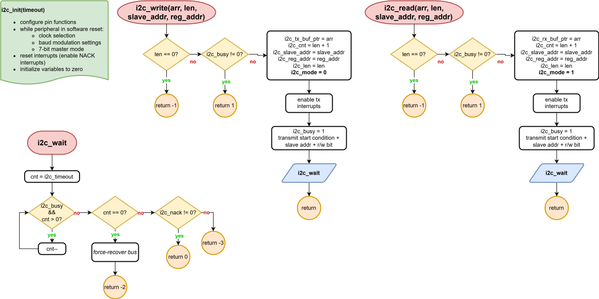
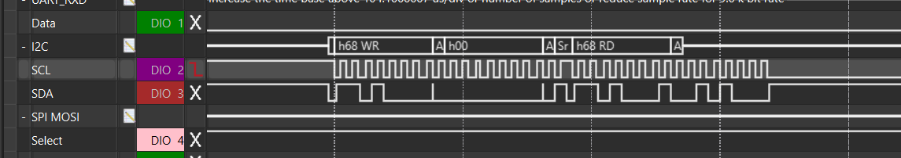
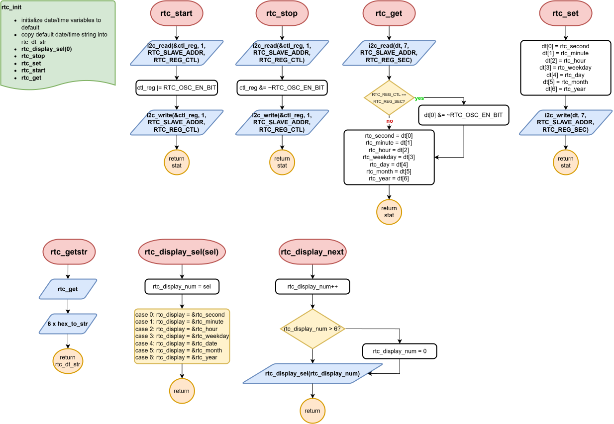
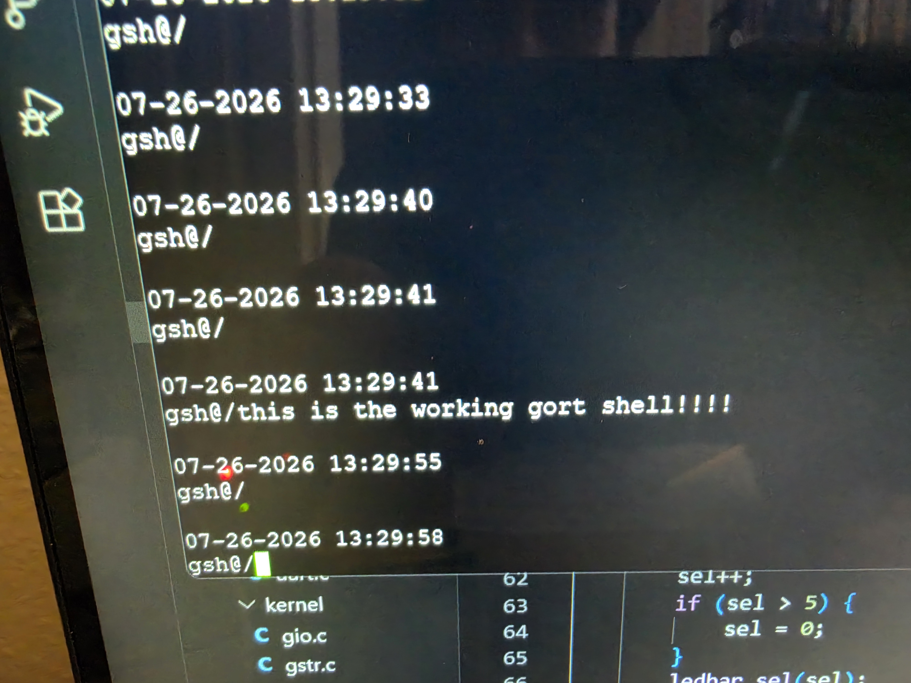

# Lab 3: RTC and LED Patterns

#### Ryan Dupuis
#### EELE 465 | ~7/26/2026

## Introduction

In this lab, we harken back to the days of SoC FPGAs I. Fortunately, instead of several labs having blinking LEDs as the core component, only one will. A natural first step for Gort OS is to make it blink some lights (because they're cool to look at ::) and interface with a Real-Time Clock (RTC) over I2C (where we left off in EELE 371).

This time, modularity and consistency in code has brought mostly promising results. An issue arose where the I2C peripheral would jam after exactly 2 read transactions, so . 

The source files are located here: [mcu/src/](../../mcu/src/).

From this lab onward, all port/pin function configurations can be found in the header file [pfc.h](../../mcu/include/hw/pfc.h).

> [!NOTE]
> This documentation page was created about 3-4 weeks after the code was completed and verified.

## Circuit Diagram
### Requirements met: 1-4, 13, 14

## [UART Driver](../../mcu/src/drivers/uart.c)
### Prerequisite for displaying/setting RTC time

A Universal Asynchronous Receiver Transmitter (UART) is a very simple serial protocol. Through only a single wire, streams of bytes can be sent into the abyss without any warning. Thanks to the MCU's eUSCI peripherals, it can be made quite easy.

A pointer and length is passed to `uart_tx` or `uart_rx` to tell the driver exactly which bytes in memory, specified elsewhere, must be read/written. Transmit interrupts are used to continue transmitting bytes automatically. When `uart_busy` is 1, the ISR is currently handling Tx/Rx.

The UART pins (**P4.2 and P4.3**) are connected to a **CP2102N Adafruit USB-to-UART "Friend"**, which converts the signal into USB and facilitates communication between Gort OS and an external serial monitor.

## [I2C Driver](../../mcu/src/drivers/i2c.c)
### Prereqisite for RTC

Creating the Gort I2C Driver has been a rollercoaster of an endeavor. The peripheral makes you do a lot more work to create a basic, modular interface than for UART. Most of the complex logic is in the ISR.

The `i2c_write` and `i2c_read` functions are used to write and read arrays of data from an I2C slave at a specific register. They are nearly identical apart from `i2c_mode`, which is set to 0 for a write and 1 for a read. If in read mode, the ISR will first send the register address, then transition to reading by generating a repeated start. When `i2c_busy` is 1, the ISR is currently handling Tx/Rx.

An additional `i2c_wait` function was created to count down from a specified timeout value and attempt to recover the bus if the count reached zero. The timeout should be tuned to a sufficiently large value so as to not reach 0 during normal driver usage.

The I2C pins (**P4.6, P4.7**) are currently connected to the **MCP7940N RTC Module**.

### Issues

Occasionally, if the RTC was read from *frequently*, the I2C bus would jam. It would occur randomly (10 s to 10+ min) on programs where the RTC was consistenly read from. The cause of this is still unknown. To make matters worse, a change made in the `dev` branch (specifically commit `59e6d2`) somehow caused the issue to occur during every single [gsys initialization](../../mcu/src/kernel/gsys.c) on precisely the 2nd call to `i2c_read`.

According to the screenshot, the jam would occur inside a read transaction after the 1st byte was read from the slave. No NACK means the slave will hold SDA low and attempt to send more data, but the eUSCI peripheral seems to completely halt. Efforts have been made to recover the peripheral and bus, to no avail - the only fix is a hard reset.

There's a strong possibility that I switch to using the bit-banged I2C driver from [Lab 2](lab2_i2c_bb.md), but instead implemented in C. The Gort OS philosophy is indeed to do everything from scratch, but that will be a last resort. Texas Instruments is definitely testing my patience.

## [RTC Driver](../../mcu/src/devices/rtc.c)
### Requirements met: 5-10, 14, 23-28

Moving one layer up in abstraction, the RTC Driver is responsible for starting, stopping, setting, and getting the time from (ideally) almost any RTC.

The currently connected RTC is the **MCP7940N**.

### [Integer and String Conversion](../../mcu/src/kernel/gstr.c)

## [Patterns Driver](../../mcu/src/devices/patterns.c)
### Requirements met: 14, 17-22

This module, despite residing in [src/devices/](../../mcu/src/devices), is contained entirely within the MCU. It generates various fun 10-bit patterns, accessed through pointers.

## [Gort System](../../mcu/src/kernel/gsys.c)
### Requirements met: 2, 3, 13

## [Gort Shell](../../mcu/src/apps/gsh.c)
### Requirements met: 11, 12

### [String Manipulation](../../mcu/src/kernel/gstr.c)

## Conclusion
### Unmet requirements: 15, 16

