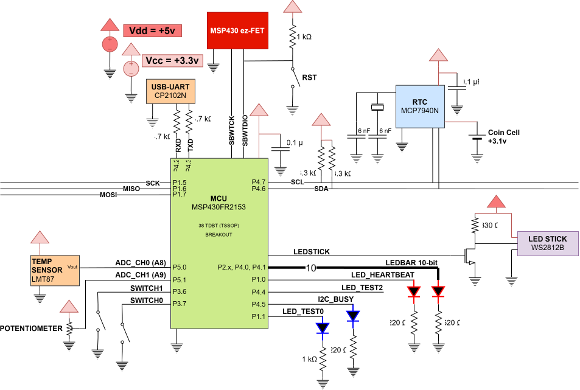
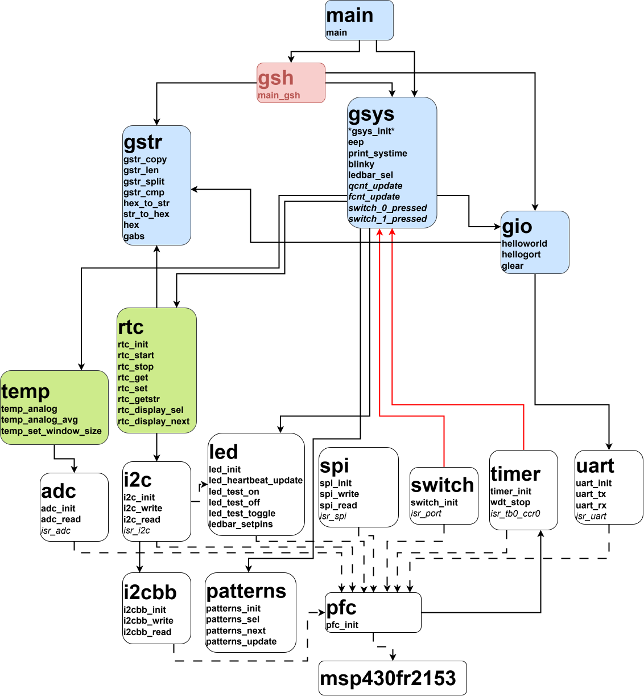
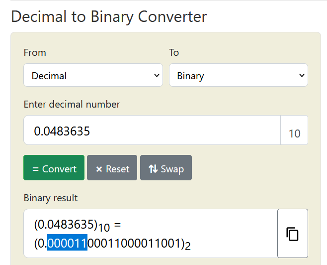
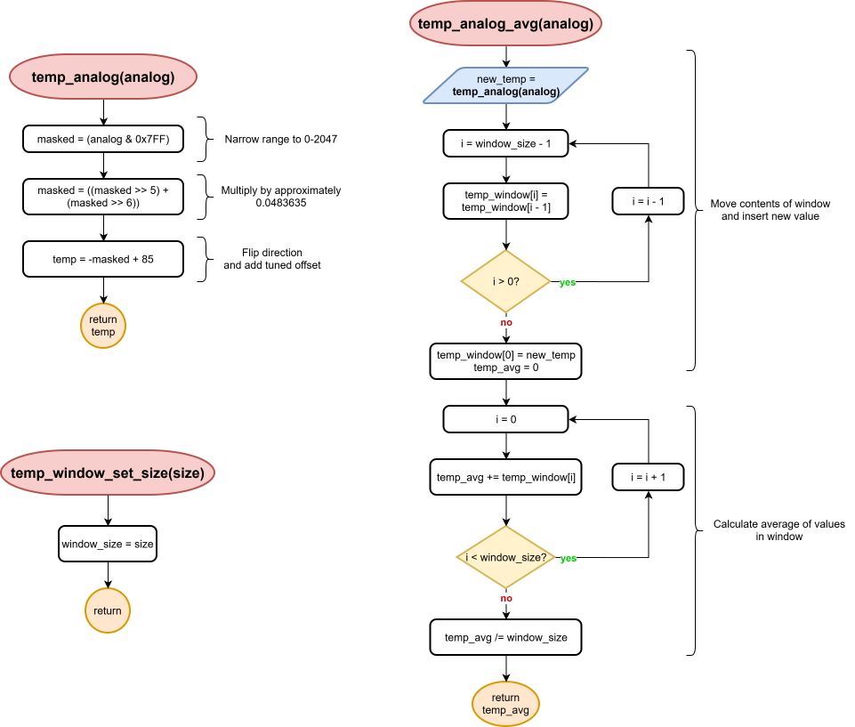
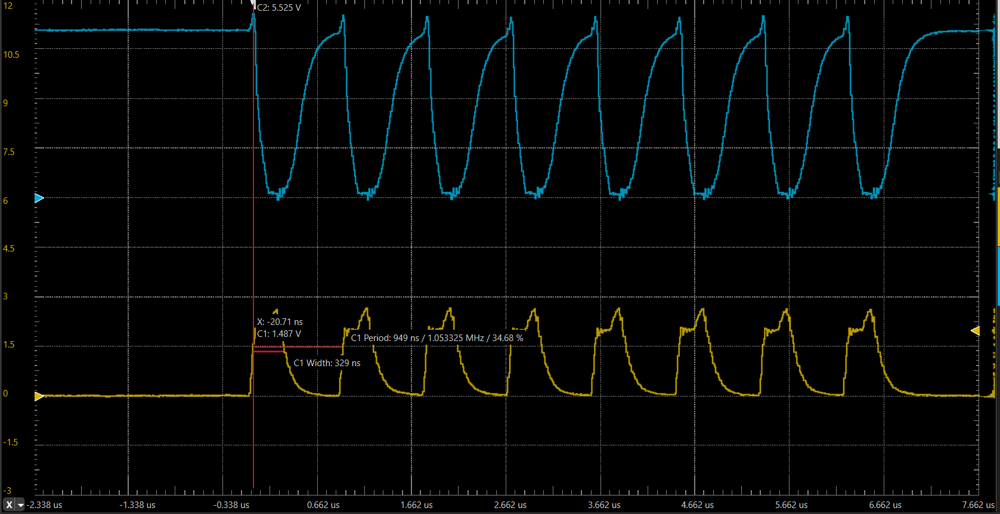

# Lab 4: ADC and SPI

#### Ryan Dupuis
#### EELE 465 | 9/14/2026

## Introduction

In this lab, 

All source files are located here: [mcu/src/](../../mcu/src/).

## Circuit Diagram
### Requirements met: 



## Software Architecure



## Analog-to-Digital Conversion
### Requirements met: 

The driver for Gort's [ADC peripheral](../../mcu/src/drivers/adc.c)

```c
void adc_init(void);
unsigned int adc_read(unsigned char ch);
```


## Temperature Sensor Driver
### Requirements met: 

Building on top of the ADC driver, I developed another driver for Gort's first [temperature sensor](../../mcu/src/devices/temp.c), specifically the analog LMT87. This device is super simple, with just one analog output voltage that corresponds to some temperature between -50 and 150 C. The datasheet provides a table for which temperatures correspond to which voltages. I used this info, combined with ADC values obtained from the potentiometer, to fill in the following table:

| Measured Voltage (V) | ADC Value | Temperature (C) |
|----------------------|-----------|-----------------|
| 3.277 | N/A   | -50  |
| 2.75  | 0xFFF | -8   |
| 2.37  | 0xD40 | 19.6 |
| 1.39  | 0x800 | 91   |
| 0.538 | 0x356 | 150  |
| <0.01 | 0x000 | N/A  |

Considering the mismatch between ranges, I decided to compromise by chopping the ADC range in half (ignoring the MSB) to create an 11-bit range (0x800-0xFFF => 0x000-0x7FF). This corresponds to an operational temperature range of -8 to 91 C, good enough for now. I also linearly interpolated within this range to arrive at a function for calculating temperature (T_C) given the ADC value (x):

$$T_C = (-0.0483635)x + 91$$

Since it's much easier and faster to work with binary integers, I was curious to see what this fraction was in binary:



So I made a rough approximation of multiplication by 0.0483635 using two bit-shifts:

```c
masked = ((masked >> 5) + (masked >> 6))
```

This is the same as multiplying by (1/32 + 1/64), which is 0.046875, close enough to the desired number.

```c
int temp_analog(unsigned int analog);
int temp_analog_avg(unsigned int analog);
void temp_window_set_size(unsigned int size);
```



The "91" figure from the calculations was changed to 85, which Once the temperature conversion was reasonable, I added a moving average window. This adds each reading to a queue, of which the average is calculated and returned in `temp_analog_avg`. The oldest values are discarded. The caller still must call `adc_read` separately and pass that returned value into these functions. Perhaps I will make it so that `temp` calls these functions for you.


## SPI Driver
### (Intended) prerequisite for LED Stick

The [SPI Driver](../../mcu/src/drivers/spi.c)

```c
void spi_init(
    unsigned int timeout,
    unsigned int clock_div
);
int spi_write(
    unsigned char *arr,
    unsigned int len,
    unsigned char slave,
    unsigned char *addr,
    unsigned int addr_len
);
int spi_read(
    unsigned char *arr,
    unsigned int len,
    unsigned char slave,
    unsigned char *addr,
    unsigned int addr_len
);
```


## LED Stick Driver

I attempted to interface with the WS2812B RGB LED stick, which is a very strange "serially"-addressable module. After encountering great difficulty when trying to abuse the SPI MOSI line, I switched to bit-banging the data directly from `gsys`, so it doesn't technically have its own driver file. Unfortunately, the timing requirements are incredibly tight and unlike any other device I've seen. Logic 1's are counted as a long-pulse (66% duty) and logic 0's are counted as a short-pulse (33% duty) with a lightning-fast ~1 microsecond period. To further complicate matters, the LED stick wants a 5v input, not 3.3v. This required a simple NMOS inverter that steps up the MCU output, as seen in the circuit diagram at the start.

```c
unsigned char b = 0x4D;
unsigned char s = (b & 0x80);
unsigned int i;
for (i = 0; i < 8; i++)
{
    LEDSTICK_PORT &= ~LEDSTICK_PIN;
    if (s) {
        __asm__ __volatile__("nop");
    }
    LEDSTICK_PORT |= LEDSTICK_PIN;
    s = ((b << 1) & 0x80);
}
```



The oscilloscope screenshot represents the best results I was able to obtain. The yellow channel (bottom) shows the MCU output voltage and the top channel (blue) shows the voltage at the drain terminal of the NMOS. The period is about 950 ns with a consistent ~33% duty cycle. As evident by the waveform, there are capacitive effects with the NMOS that are causing delays when switching at such a high speed.

I've had a difficult time fitting in the necessary test code without causing too much delay to where the duty cycle is messed up or the period is too long. I hate this LED stick and its manufacturers are evil.


## Conclusion
### Unmet requirements: 

